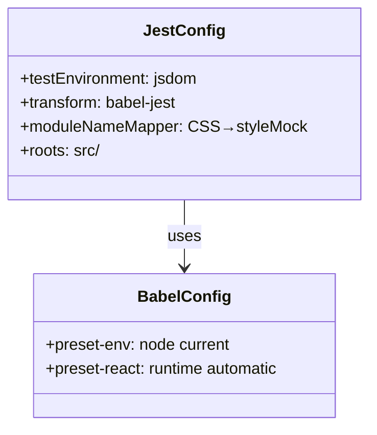
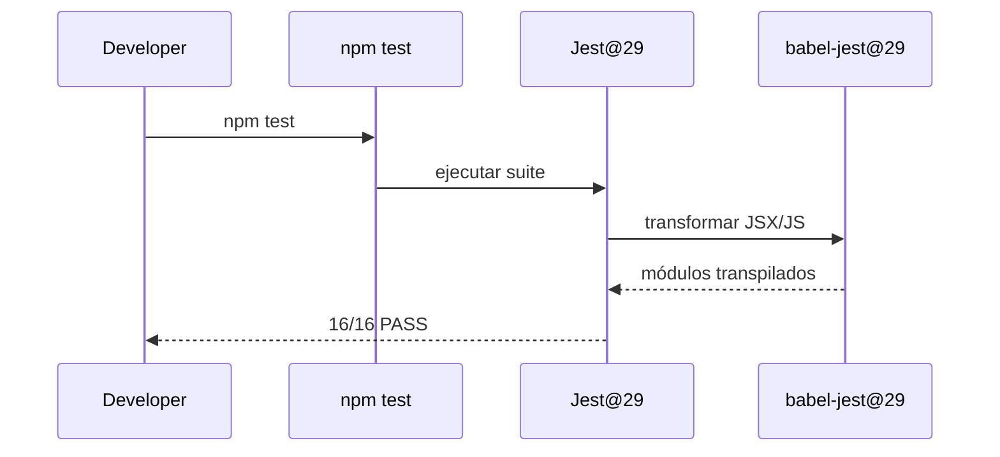
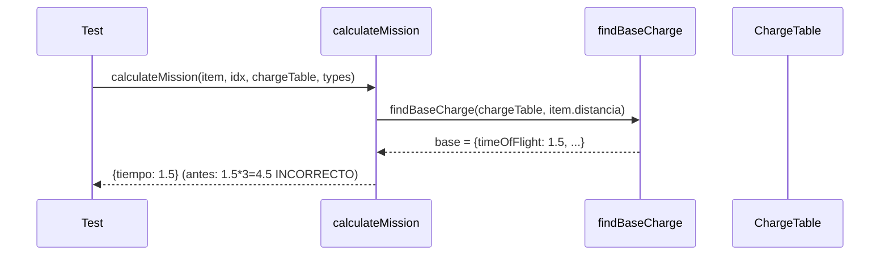
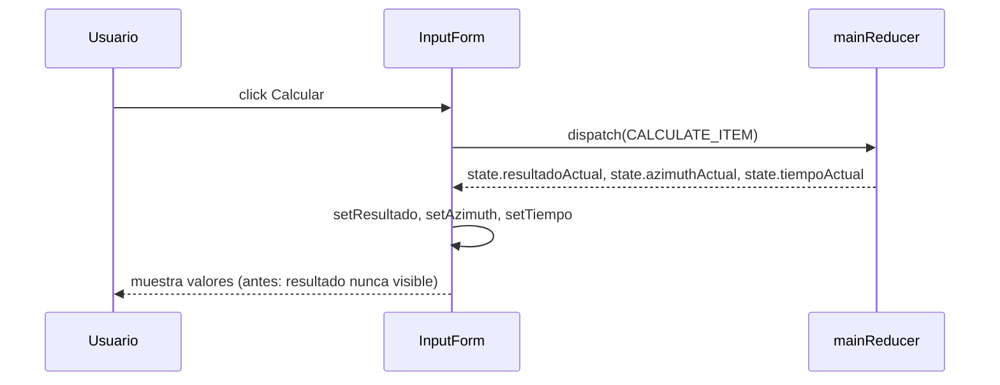
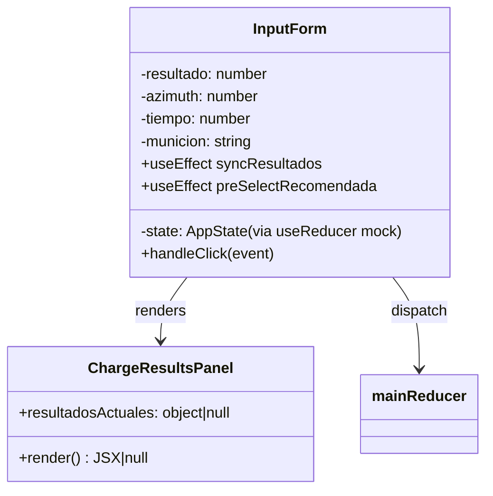
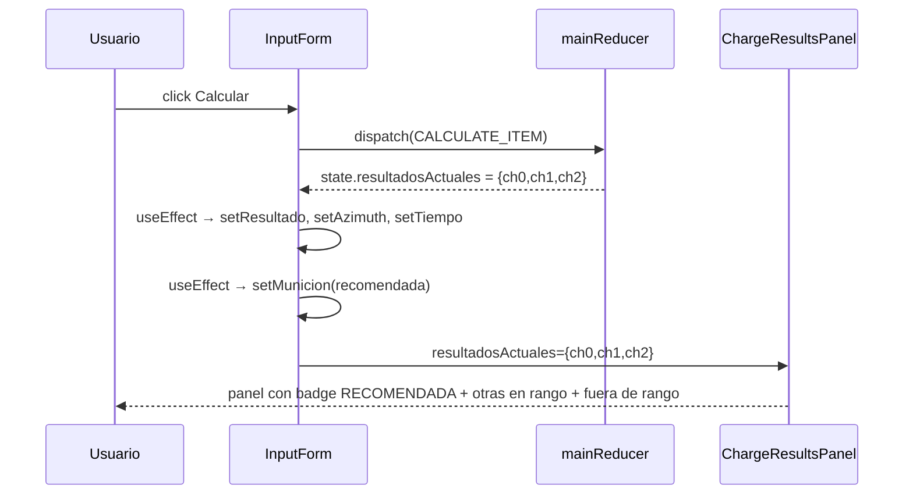

# Documentación Técnica: bugfix-and-improvements

## Hito 1: Fix configuración Jest
**Fecha:** 2026-03-12  
**Commit:** `fa52e8e`

### Entidades
| Nombre | Tipo | Acción | Archivo | Descripción |
|--------|------|--------|---------|-------------|
| `package.json` | módulo | modificada | `package.json` | Actualiza jest@27→@29, babel-jest@29, @babel/preset-react@7, jest-environment-jsdom@29; mueve @testing-library a devDependencies |
| `babel.config.js` | módulo | modificada | `babel.config.js` | Añade @babel/preset-react con runtime 'automatic' para transpilar JSX |
| `jest.config.js` | módulo | modificada | `jest.config.js` | testEnvironment jsdom, moduleNameMapper para CSS, elimina mapeo manual de mision.entity |
| `styleMock.js` | módulo | creada | `__mocks__/styleMock.js` | Mock vacío para imports CSS/LESS/SCSS en tests |

### Diagrama de Clases

### Diagrama de Secuencia

## Hito 2: Fix BUG-02 — timeOfFlight correcto
**Fecha:** 2026-03-12  
**Commit:** `0eb5548`

### Entidades
| Nombre | Tipo | Acción | Archivo | Descripción |
|--------|------|--------|---------|-------------|
| `calculateMission` | función | modificada | `src/lib/main.reducer.js` | Corrige tiempo de vuelo: usa `base.timeOfFlight` en lugar de `base.timeOfFlightPer100m * (distancia/100)` |

### Diagrama de Secuencia

## Hito 3: Fix BUG-01 — state.resultadoActual en InputForm + tiempoActual
**Fecha:** 2026-03-12  
**Commit:** `a722ff3`

### Entidades
| Nombre | Tipo | Acción | Archivo | Descripción |
|--------|------|--------|---------|-------------|
| `initialState.tiempoActual` | tipo/DTO | modificada | `src/lib/main.reducer.js` | Añade campo `tiempoActual: 0` al estado inicial del reducer |
| `mainReducer CALCULATE_ITEM` | función | modificada | `src/lib/main.reducer.js` | Añade `tiempoActual: result.tiempo` al return del case |
| `InputForm` | componente | modificada | `src/organisms/InputForm/InputForm.js` | Corrige `state.resultado→state.resultadoActual` en useEffect; añade `[tiempo, setTiempo]` |

### Diagrama de Secuencia

## Hito 6: UI panel de 3 cargas, etiquetas de resultado y pre-selección
**Fecha:** 2026-03-12  
**Commit:** `855a21e`

### Entidades
| Nombre | Tipo | Acción | Archivo | Descripción |
|--------|------|--------|---------|-------------|
| `ChargeResultsPanel` | componente | creada | `src/organisms/InputForm/InputForm.js` | Componente puro que recibe `resultadosActuales` y renderiza el panel de 3 cargas con sección recomendada, otras en rango y fuera de rango |
| `InputForm` | componente | modificada | `src/organisms/InputForm/InputForm.js` | Reemplaza `
{resultado}
` por bloque con etiquetas `resultado-actual`; añade `useEffect` de pre-selección; integra `ChargeResultsPanel` |
| `InputForm.css` | módulo | modificada | `src/organisms/InputForm/InputForm.css` | Añade 5 clases CSS: `.carga-recomendada-principal`, `.badge-recomendada`, `.otras-cargas-en-rango`, `.carga-row.secundaria`, `.carga-row.fuera-de-rango` |
| `InputForm.test.js` | módulo | creada | `src/organisms/InputForm/InputForm.test.js` | 9 tests RTL que mockean `useReducer` de React para controlar el estado del componente |

### Diagrama de Clases

### Diagrama de Secuencia

