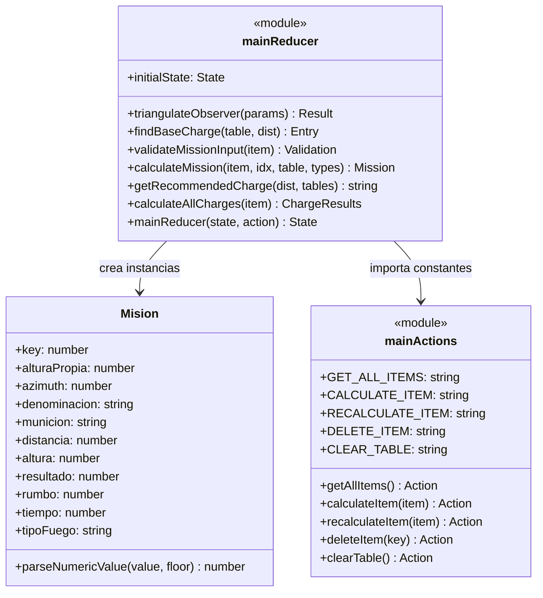
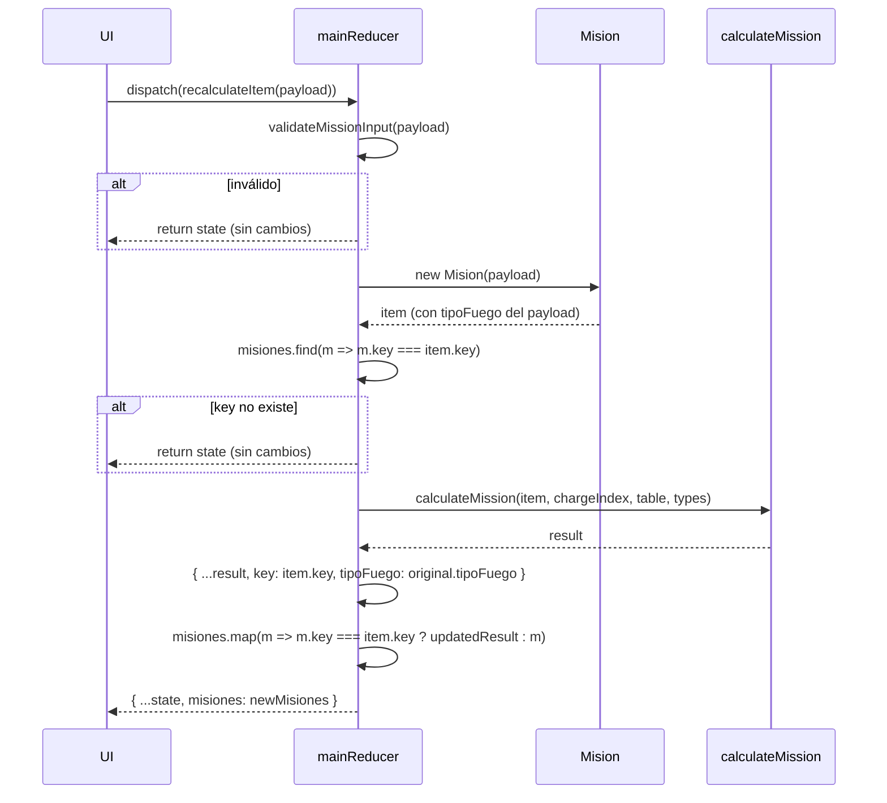
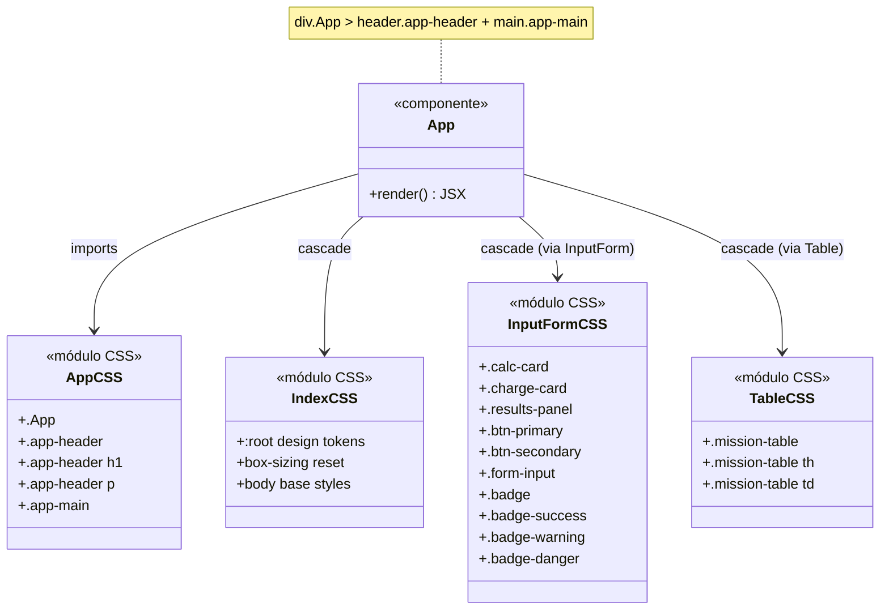
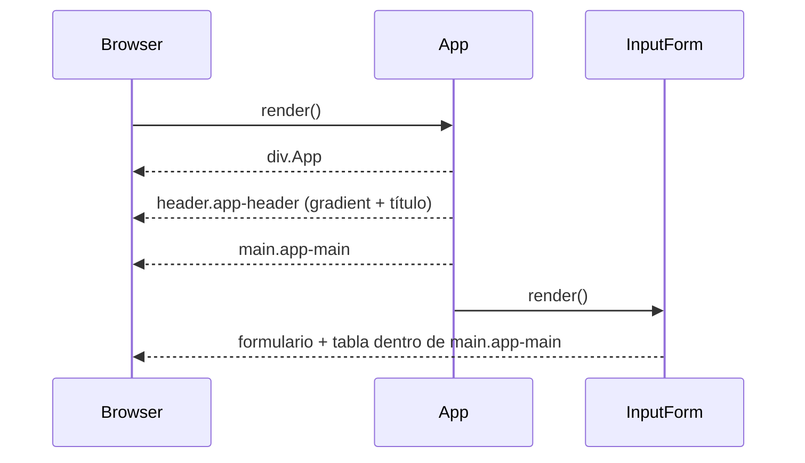
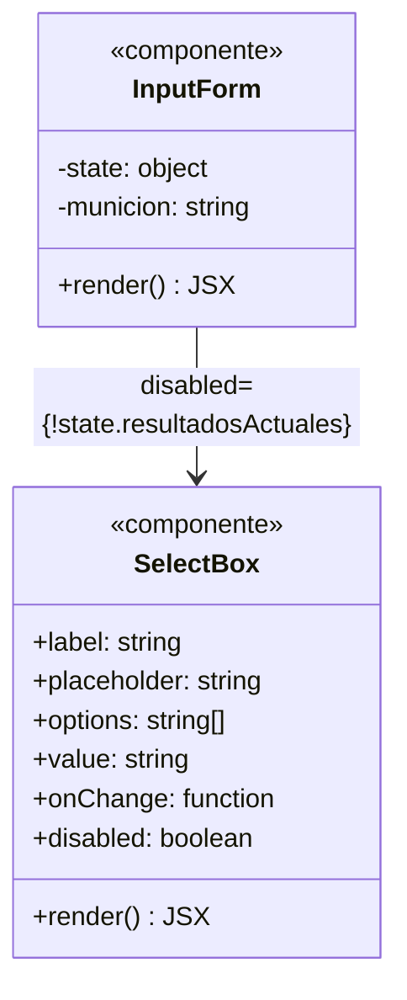
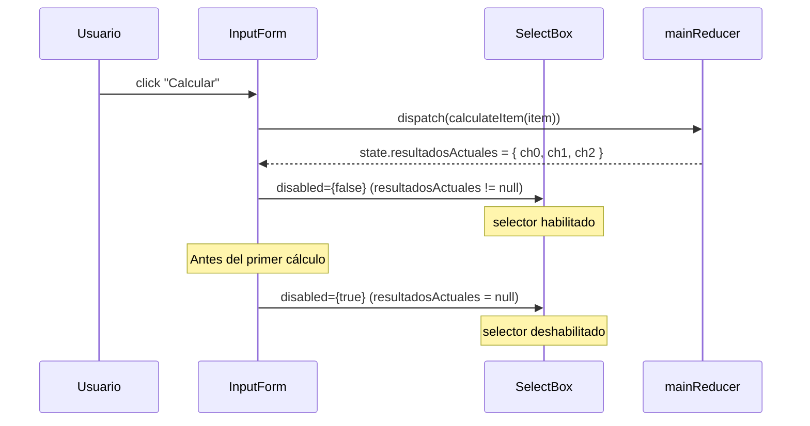
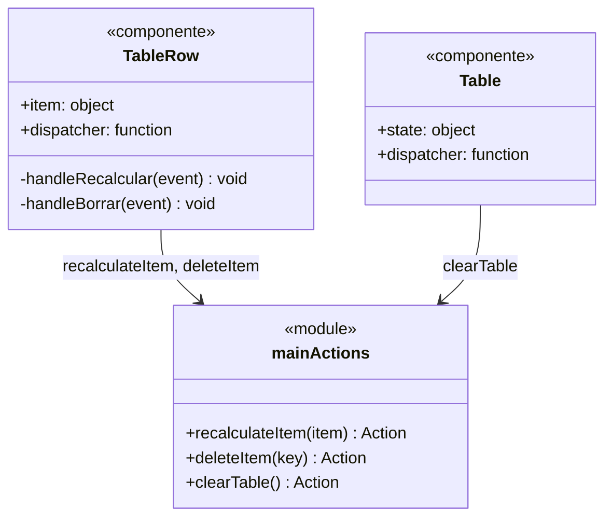
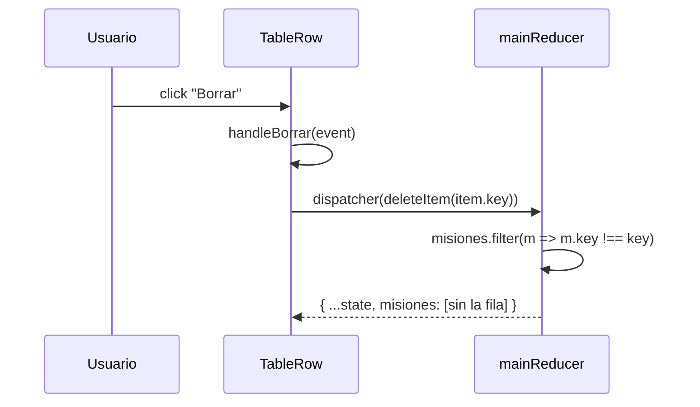
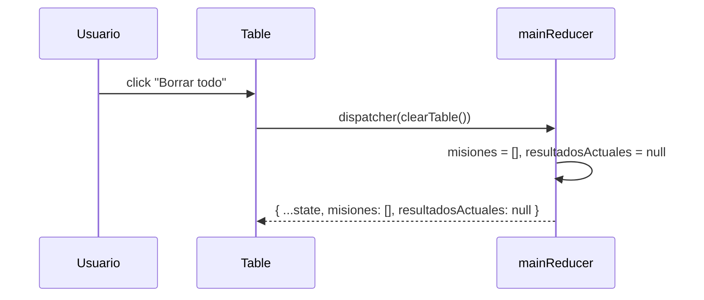

# Documentación Técnica: ui-redesign-indirect-fire

## Hito 1: Reducer — nuevas acciones y lógica de fuego indirecto
**Fecha:** 2026-03-13  
**Commit:** `3c82c48`

### Entidades

| Nombre | Tipo | Acción | Archivo | Descripción |
|--------|------|--------|---------|-------------|
| `RECALCULATE_ITEM` | módulo | modificada | `src/lib/main.actions.js` | Constante de acción para recalcular una misión existente en el historial por su `key` |
| `DELETE_ITEM` | módulo | modificada | `src/lib/main.actions.js` | Constante de acción para eliminar una misión del historial por su `key` |
| `CLEAR_TABLE` | módulo | modificada | `src/lib/main.actions.js` | Constante de acción para vaciar el historial completo de misiones |
| `recalculateItem(item)` | función | modificada | `src/lib/main.actions.js` | Action creator; payload = item (debe incluir `item.key`) |
| `deleteItem(key)` | función | modificada | `src/lib/main.actions.js` | Action creator; payload = `{ key }` |
| `clearTable()` | función | modificada | `src/lib/main.actions.js` | Action creator sin payload |
| `Mision.DEFAULT_VALUES.tipoFuego` | tipo/DTO | modificada | `src/data/mision.entity.js` | Nuevo campo con default `'directo'`; admite `'directo'` \| `'indirecto'` |
| `Mision.tipoFuego` | tipo/DTO | modificada | `src/data/mision.entity.js` | Propiedad de instancia asignada desde `config.tipoFuego` sin parseo numérico |
| `triangulateObserver` | función | creada | `src/lib/main.reducer.js` | Función pura que triangula posición del objetivo dados distancia/rumbo mortero↔observador y observador↔objetivo, retorna `{ distancia, rumbo }` en metros y mils NATO |
| `RECALCULATE_ITEM` case en `mainReducer` | módulo | modificada | `src/lib/main.reducer.js` | Actualiza la misión con el `key` dado en `misiones[]` sin añadir filas; preserva `tipoFuego` original |
| `DELETE_ITEM` case en `mainReducer` | módulo | modificada | `src/lib/main.reducer.js` | Filtra `misiones[]` eliminando la entrada con el `key` dado; no modifica `index` |
| `CLEAR_TABLE` case en `mainReducer` | módulo | modificada | `src/lib/main.reducer.js` | Resetea `misiones: []` y `resultadosActuales: null` simultáneamente |

### Diagrama de Clases



### Diagrama de Secuencia — RECALCULATE_ITEM



### Diagrama de Secuencia — triangulateObserver

```mermaid
sequenceDiagram
    participant Caller
    participant tri as triangulateObserver

    Caller->>tri: { d_mo, rumbo_mo, d_oo, rumbo_relativo_oo }
    tri->>tri: rumbo_mo_rad = rumbo_mo * π/3200
    tri->>tri: ox = d_mo * sin(rumbo_mo_rad)
    tri->>tri: oy = d_mo * cos(rumbo_mo_rad)
    tri->>tri: rumbo_abs = (rumbo_mo + rumbo_relativo_oo) % 6400
    tri->>tri: tx = ox + d_oo * sin(rumbo_abs_rad)
    tri->>tri: ty = oy + d_oo * cos(rumbo_abs_rad)
    tri->>tri: distancia = round(sqrt(tx²+ty²))
    tri->>tri: rumbo_rad = atan2(tx, ty); if < 0 += 2π
    tri->>tri: rumbo = round((rumbo_rad * 3200/π) % 6400)
    tri-->>Caller: { distancia, rumbo }
```

---

## Hito 2: UI Redesign — CSS global y componentes estilizados
**Fecha:** 2026-03-13  
**Commit:** `3d23cd1`

### Entidades

| Nombre | Tipo | Acción | Archivo | Descripción |
|--------|------|--------|---------|-------------|
| `:root` design tokens | módulo | modificada | `src/index.css` | Bloque `:root` con 18 custom properties: colores, gradiente, radios, sombras, fuente y transición |
| `* { box-sizing }` + `body` | módulo | modificada | `src/index.css` | Reset universal box-sizing; body con `--color-background`, `--font-family`, `margin: 0` |
| `.App` | componente | modificada | `src/App.css` | Layout raíz; `min-height: 100vh`, fondo `--color-background` |
| `.app-header` | componente | modificada | `src/App.css` | Header con `--color-header-gradient` (verde→azul), padding `24px 32px`, texto blanco |
| `.app-header h1` | componente | modificada | `src/App.css` | Título principal: `1.75rem`, `font-weight: 700`, `letter-spacing: -0.5px` |
| `.app-main` | componente | modificada | `src/App.css` | Contenedor principal centrado: `max-width: 1200px`, flex column, gap `24px` |
| `App` | componente | modificada | `src/App.js` | Añadido `<header class="app-header">` y `<main class="app-main">` como estructura semántica |
| `.calc-card`, `.charge-card`, `.results-panel` | módulo | modificada | `src/organisms/InputForm/InputForm.css` | Cards con sombras y radios de design tokens; panel de resultados flex-wrap |
| `.btn-primary`, `.btn-secondary` | módulo | modificada | `src/organisms/InputForm/InputForm.css` | Botones con colores de tokens, transición `--transition-fast` |
| `.form-input` | módulo | modificada | `src/organisms/InputForm/InputForm.css` | Input estilizado con borde `--color-border`, focus con `--color-primary` |
| `.badge`, `.badge-success`, `.badge-warning`, `.badge-danger` | módulo | modificada | `src/organisms/InputForm/InputForm.css` | Sistema de badges pill con colores semánticos |
| `.mission-table` | módulo | modificada | `src/molecules/Table/Table.css` | Tabla con `border-radius`, `overflow: hidden` y sombra card; filas hover con `--color-background` |
| `App.test.js` | otro | creada | `src/App.test.js` | 3 tests RTL: `.app-header` presente, `.app-main` presente, `h1` contiene "MK252" |

### Diagrama de Clases



### Diagrama de Secuencia — Render de App con layout semántico



---

## Hito 3: Selector de munición deshabilitado + prop `disabled` en SelectBox
**Fecha:** 2026-03-13  
**Commit:** `7880dd9`

### Entidades

| Nombre | Tipo | Acción | Archivo | Descripción |
|--------|------|--------|---------|-------------|
| `SelectBox` | componente | modificada | `src/molecules/SelectBox/SelectBox.js` | Añadida prop `disabled` desestructurada y propagada al `<select>` nativo |
| `InputForm` | componente | modificada | `src/organisms/InputForm/InputForm.js` | `SelectBox` de munición recibe `disabled={!state.resultadosActuales}` |
| `SelectBox.test.js` | otro | creada | `src/molecules/SelectBox/SelectBox.test.js` | 3 tests: disabled=true deshabilita, disabled=false habilita, ausencia de prop no deshabilita |
| `InputForm.test.js` | otro | modificada | `src/organisms/InputForm/InputForm.test.js` | 3 tests nuevos: selector deshabilitado con resultadosActuales=null, habilitado con resultados, valor inicial ch0 |

### Diagrama de Clases



### Diagrama de Secuencia — Control disabled del selector



---

## Hito 4: Botones borrar fila y borrar tabla
**Fecha:** 2026-03-13  
**Commit:** `065b043`

### Entidades

| Nombre | Tipo | Acción | Archivo | Descripción |
|--------|------|--------|---------|-------------|
| `TableRow` | componente | modificada | `src/molecules/Table/TableRow.js` | Botón "Recalcular" ahora despacha `recalculateItem` (no `calculateItem`); añadido botón "Borrar" que despacha `deleteItem(item.key)` |
| `Table` | componente | modificada | `src/molecules/Table/Table.js` | Añadido `<tfoot>` con botón "Borrar todo" que despacha `clearTable()` |
| `TableRow.test.js` | otro | modificada | `src/molecules/Table/TableRow.test.js` | Añadidos tests para `recalculateItem` en click de Recalcular y `deleteItem` en click de Borrar |
| `Table.test.js` | otro | modificada | `src/molecules/Table/Table.test.js` | Añadidos tests para render del botón "Borrar todo" y despacho de `clearTable` |

### Diagrama de Clases



### Diagrama de Secuencia — Borrar fila



### Diagrama de Secuencia — Borrar todo


